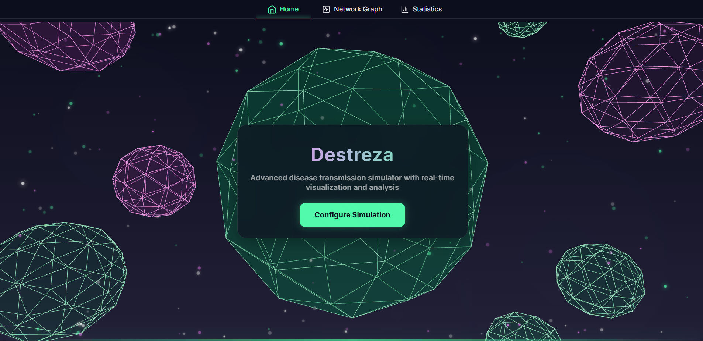
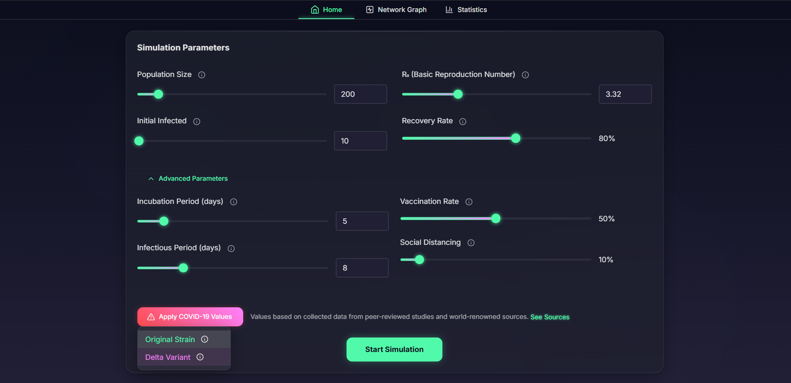
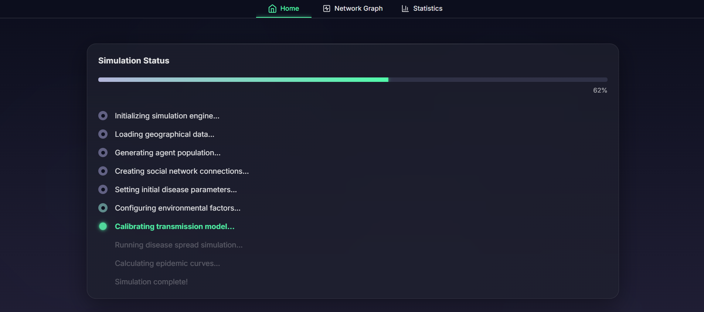
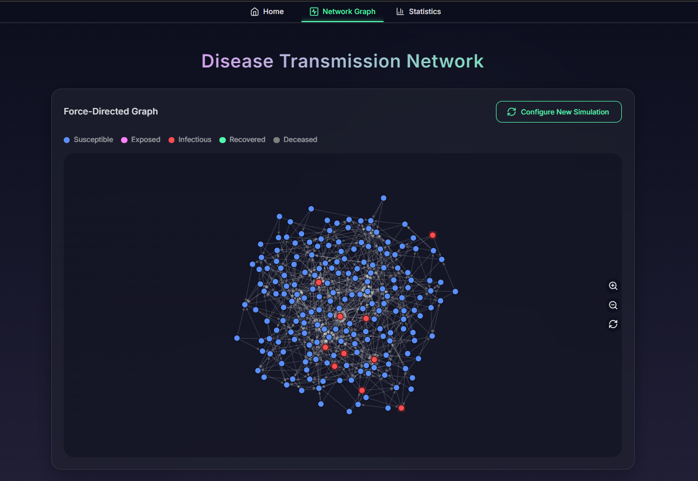
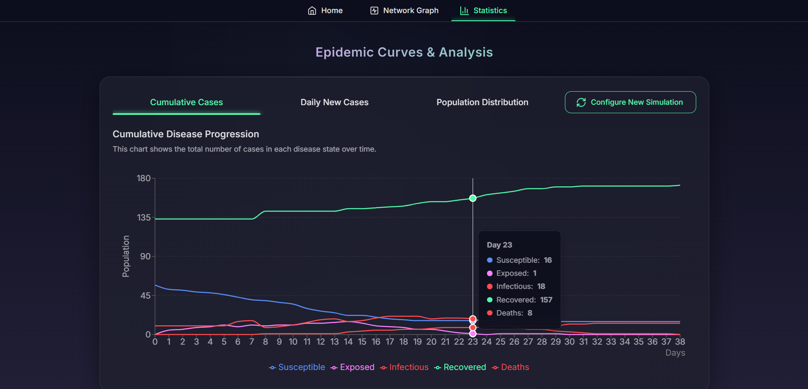

# Destreza: An Advanced Disease Simulation Platform (Prototype)

🔗 [View Live Demo](https://euphonious-phoenix-d841db.netlify.app/)

This is a prototype for Destreza, a sophisticated disease transmission simulator prototype that showcases cutting-edge UI/UX design and modern web development practices. The core simulation engine and force-directed graph are placeholder components, not intended for further development. The project is meant to showcase exceptional frontend architecture and interactive visualization design.

For the fully functional version with a working disease simulation and force-directed graph, refer to the main [Destreza project](https://github.com/MuqaddasC2/Destreza_Disease_Simulator).

## User Interface

The interface combines modern aesthetics with functional design, featuring a stunning landing page with dynamic particle effects that respond to user movement. The UI employs a dark theme with vibrant accent colors, creating an immersive and futuristic experience. Interactive elements and smooth animations provide immediate visual feedback, while the responsive design ensures a seamless experience across all devices.




The application's simulation parameters dashboard presents complex data in an intuitive format, with animated transitions and interactive elements that make data exploration engaging and informative.







Real-time data visualization brings statistics to life through animated charts and graphs, helping users understand disease progression patterns at a glance.



## ☣️ Key Features

- **Advanced Visualization System**
  - Real-time statistical analysis
  - Interactive data exploration
  - Dynamic chart animations
  - Responsive data presentation

- **Interactive Controls**
  - Parameter configuration system
  - Animation timeline control
  - Real-time simulation updates
  - Customizable settings

- **Data Analysis Tools**
  - Time series progression
  - Population distribution
  - Daily case tracking
  - Network visualization (prototype)

- **Modern Architecture**
  - Built with React 18 and TypeScript
  - Material-UI with custom theme system
  - Context-based state management
  - Modular component architecture

## 🛠️ Technology Stack

- **Frontend Framework**: React 18.3.1
- **Type System**: TypeScript
- **UI Framework**: Material-UI (MUI)
- **Styling**: Tailwind CSS
- **Animations**: Framer Motion
- **Charts**: Recharts
- **Icons**: Lucide React
- **Network Visualization**: D3.js
- **Build Tool**: Vite

## 🧬 Getting Started

```bash
# Clone the repository
git clone https://github.com/yourusername/destreza.git

# Install dependencies
npm install

# Start development server
npm run dev
```

## 🧫 Project Status

This is a prototype focusing on UI/UX excellence. While the interface is production-ready, the core simulation engine and network visualization are placeholder components not intended for further development. The project serves as a demonstration of modern frontend development practices and advanced UI patterns.

### Current Limitations
- Disease simulation engine needs refinement
- Network graph visualization requires optimization
- Real-time data processing needs improvement

## 💊 Future Development

- Implement full SEIRD model simulation
- Optimize force-directed graph performance
- Add more intervention strategies
- Integrate with backend services
- Add user authentication system
- Enable simulation data export

## 📜 License

MIT License - feel free to use this code for your own projects.

## 🤝 Contributing

While this is a prototype, contributions are welcome! Please feel free to submit a pull request.

## 🙏 Acknowledgments

- Material-UI for the component library
- Framer Motion for animations
- D3.js community for visualization tools
- React ecosystem contributors
